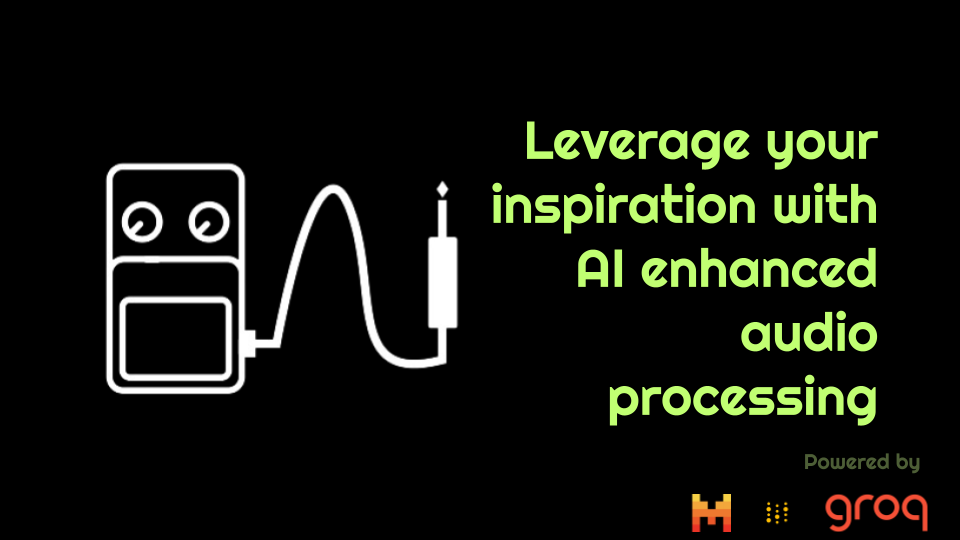

# PedalAI

Developed by Team *HarmonicHackers* in the context of MistralAI's Paris Hackathon 2024 in Station F.

Team members:
- Eliott Flechtner
- Titouan Verhille
- Sriram Vadlamani 

Introducing Pedal, the audio effect assistant made for you!

## Inspiration
🎸 The inspiration for PedalAI came from **our love for music and technology**! We wanted to create a tool that would allow **beginners** to _seamlessly create_ with the power of artificial intelligence, just like a virtual pedalboard!

## What it does
🎛️ PedalAI allows users to **import audio tracks** and apply various AI-powered sound effects, enhancing the sound in _creative and unique ways_. From adding _reverb_ and _distortion_ to creating entirely new soundscapes from a single prompt, PedalAI offers a **wide range of customization options** to transform your music **effortlessly**. It also allows for applying effects on the whole track or only parts of it using **range selection sliders**! You may reverse any changes made to your track and 

## How we built it
🛠️ We built PedalAI using audio processing libraries like Pedalboard coupled with a user-friendly interface. The back-end leverages a combination of **MistralAI's large and small models** to understand the user queries, while the front-end is designed to be _intuitive_, enabling users to apply and tweak effects with ease.

## Challenges we ran into
🚧 We faced **several challenges** during the development of PedalAI, including using faster tools for _real-time audio processing_ and ensuring the effects applied were of high quality. **Recommending additional effects** was also complicated.

## Accomplishments that we're proud of
🏆 We're proud of creating a platform that **brings the power of AI to musicians and audio enthusiasts**, making it easier to experiment with and enhance their tracks. Successfully integrating complex **AI models** into a **seamless user experience** and achieving real-time audio processing are significant accomplishments for our team.

## What we learned
📚 Through this project, we learned a lot about the intricacies of _audio processing_ and the potential of **AI in creative applications**. We also gained valuable experience in **optimizing using the right tools for performance and usability**, and in designing intuitive user interfaces.

## What's next for PedalAI
🚀 The next steps for **PedalAI** include **expanding the range of available effects**, improving the **AI algorithms** for even better audio quality, and adding features like **collaborative editing and cloud storage**. We also would love to have support for _user-custom effects plugins (VSTs)_ which would allow **PedalAI to truly become a go-to tool for musicians everywhere**.
